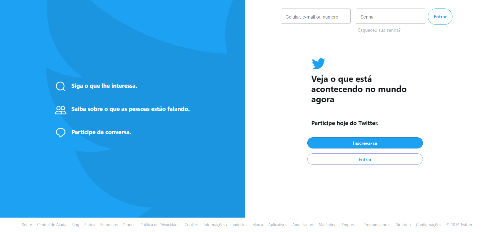

# I tried to clone twitter web page

So, first of all, i was studing this library material-ui and decide tried to clone twitter web site, but when i developed the login interface. I thinked  find "Log in" button isnt cool or really beautiful, so i changed this button for something more cool 🎉. Therefore this is my version of twitter web page.

I really need developed more components in this interface, because i using a print of images to create the dashboard image and now understood who this is image is create with css.

### **Getting Started**

We need some libraries for init this project in your machine like:

    "@material-ui/core": "^4.5.1",
    "animate.css": "^3.7.2",
    "enzyme": "^3.10.0",
    "history": "^4.10.1",
    "node-sass": "^4.13.0",
    "react": "^16.11.0",
    "react-dom": "^16.11.0",
    "react-router-dom": "^5.1.2",
    "react-scripts": "3.2.0"

For install all this modules, please, running the command below: 

`yarn install or npm install`

So, when you finished install all this modules, running the command:

`yarn start or npm start`

License MIT

